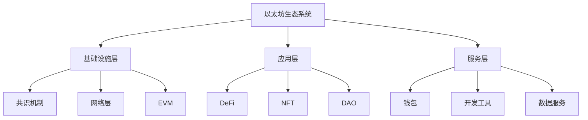

# 1. 以太坊概述

以太坊是一个开源的、去中心化的区块链平台，它不仅支持加密货币交易，还能够运行智能合约和去中心化应用（DApps）。

## 1.1 历史发展

以太坊的概念由 Vitalik Buterin 于 2013 年底首次提出，并在 2014 年 1 月的迈阿密北美比特币会议上首次公开发布。以太坊通过引入图灵完备的编程语言，极大地扩展了区块链技术的应用范围。

## 1.2 核心特点

- **智能合约平台：**支持开发者编写和部署自动执行的合约代码
- **去中心化应用：**为DApps提供运行环境和基础设施
- **以太币（ETH）：**平台原生代币，用于支付交易费用和智能合约执行
- **图灵完备：**支持复杂的程序逻辑和计算

## 1.3 技术架构

- **以太坊虚拟机（EVM）：**智能合约的运行环境，确保代码执行的一致性和安全性
- **账户系统：**包括外部账户（EOA）和合约账户两种类型
- **Gas机制：**用于计量计算资源的使用和控制交易费用
- **共识机制：**从PoW逐步过渡到PoS，提高能源效率和可扩展性

## 1.4 主要应用场景

- **去中心化金融（DeFi）：**提供借贷、交易、保险等金融服务
- **非同质化代币（NFT）：**支持数字艺术品、游戏资产等独特数字资产的创建和交易
- **去中心化自治组织（DAO）：**实现社区治理和决策的自动化
- **供应链管理：**通过智能合约实现商业流程的自动化和透明化

## 1.5 账户结构

以太坊的账户系统包含两种类型的账户，各自具有不同的特点和用途：

### 1.5.1 外部账户（EOA）

- **私钥控制：**由用户通过私钥控制
- **交易发起：**能够主动发起交易
- **状态组成：**包含余额和nonce值

### 1.5.2 合约账户

- **代码控制：**由智能合约代码控制
- **被动执行：**只能在接收到交易时执行
- **状态组成：**包含余额、代码和存储空间

## 1.6 交易结构

以太坊交易包含以下关键字段：

- **Nonce：**发送方已发送交易的序号
- **Gas Price：**交易发送方愿意支付的单位gas价格
- **Gas Limit：**交易允许消耗的最大gas量
- **To：**接收方地址
- **Value：**转移的ETH数量
- **Data：**包含合约调用数据或部署代码
- **Signature：**交易签名信息